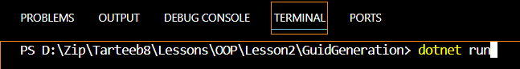
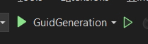

# Welcome to the project GuidGeneration
## What is this project for?
- All project steps are divided into methods
- Guid and DateTimeOffset are used
- CopyText library is used to save utcNow to clipboard

### Run the program

If you are using Visual Studio Code type dotnet run in terminal(ctrl_shift+`).


```bash
dotnet run
```

if you are using Visual Studio 2022 Click the green run button at the top(Ctrl + F5)



## what was done in the program
- installing CopyText package in NuGet 
### VS terminal 
```bash 
dotnet add package TextCopy
```
# The general code of the program
```bash
using System;
using TextCopy;
class Program
{
     static void Main(string[] args)
    {
        do{
            UserInterface();
            int checkNumber = Convert.ToInt32(Console.ReadLine());
            switch(checkNumber){
                case 1:
                string guidInfo = GuidGeneration();
                Console.WriteLine(guidInfo);break;
                case 2: UtcNowGeneration();Console.WriteLine($"Clipboard text is {ClipboardService.GetText()}");break;
                default: Console.WriteLine("Please select only 1 or 2");break;
            }
        }
        while(IsTrue());

        static void UtcNowGeneration(){
            string generationUtcNow = DateTimeOffset.UtcNow.ToString();
            TextCopy.ClipboardService.SetText(generationUtcNow);
            // Console.WriteLine($"{ClipboardService.GetText()}\nCopied...");
        }
        static bool IsTrue(){
                bool isTrue = true;
                string checkFlag ="";
                Console.WriteLine("Do you want to continue? (yes / no)");
                checkFlag = Console.ReadLine().ToLower();
                isTrue = checkFlag is "yes" or "y";
                return isTrue;
        }
        static string GuidGeneration(){
            string  generationGuid = Guid.NewGuid().ToString();
            return generationGuid;
            // Console.WriteLine($" New Guid is => {GenerationGuid}");
        }
        static void UserInterface(){
            Console.WriteLine("Welcome to the project GUID Generator!!!");
            Console.WriteLine("Select if you need new guid press 1 if you need current time press 2");
        }
    }
}
```
